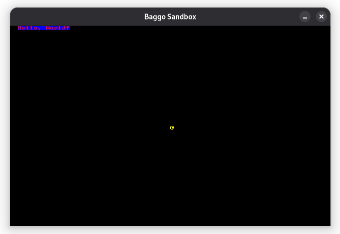

# baggo

There was a farmer who had a dog and baggo was his name-o. Except the farmer was a programmer, and the dog was a roguelike library.

## What?

`uv run sandbox.py` to render a minimal rogue-like in
[code page 437][]:



[code page 437]: https://en.wikipedia.org/wiki/Code_page_437

## Usage

### Setup

[Install `uv`][install_uv] to get started.

If you do not already have Python 3.14 installed,
`uv` will install it along with the dependencies:

```shell
uv sync
```

This will install:

1. Python >= 3.14
2. [Python Arcade's][arcade_dev] `development` branch
3. The library

[install_uv]: https://docs.astral.sh/uv/getting-started/installation/
[arcade_dev]: https://github.com/pythonarcade/arcade

### Running

Run the example from earlier with:
```
uv run sandbox.py
```

